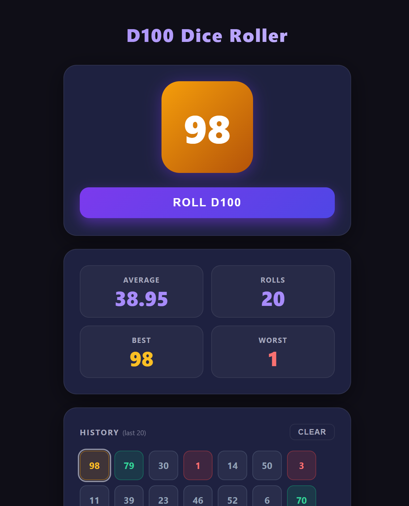

# **Dice Simulator**

Roll a virtual D100 and track your last 20 rolls along with running statistics.

#### How it works

All logic runs in the browser — no server or PHP required.
Roll history is stored in `localStorage` so it persists between sessions.

Statistics tracked: average, total rolls, best roll, and worst roll.

Rolls are colour-coded by tier:

| Range  | Tier     |
|--------|----------|
| 96–100 | Critical |
| 65–95  | Decent   |
| 6–64   | Lame     |
| 1–5    | Fumble   |

#### To install

1. Copy `index.html`, `dice.js`, and `style.css` to any web server or open `index.html` directly in a browser.

#### Requirements

- Any modern web browser (Chrome, Firefox, Safari, Edge)
- No PHP, no server-side dependencies
